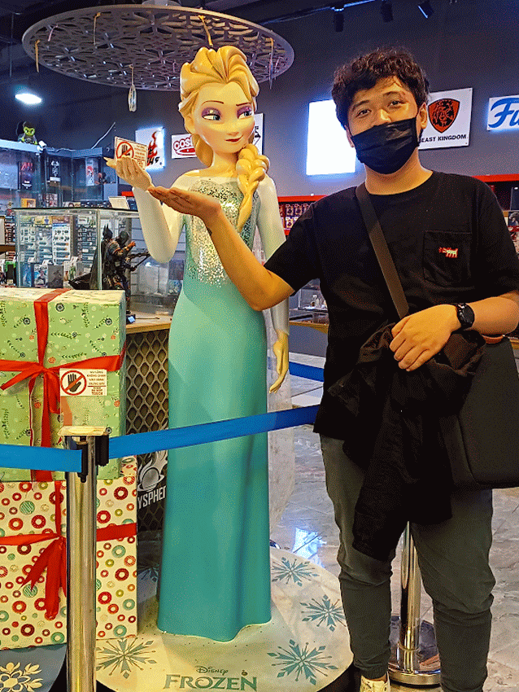

# Hey! It's me, Minh. Your friendly neighborhood Developer

Computer science nerd and aspiring software entrepreneur  
#tech #startup #engineering #backend #AI
## About Me

### Education 🎓 
- Bachelor of Engineer (Computer Science - 2017-2021) @[**Ho Chi Minh University of Technology (Bach Khoa HCM-BKU)**][university] 
- Master Degree (Data Science - 2022-2024) @[**Ho Chi Minh University of Technology (Bach Khoa HCM-BKU)**][university] 

### Start-up 🚀 
- Co-Founder @[**MedHaven**][medhaven]
- Co-Founder @[**Sensay-AI**][sensayai] 
- Entrepreneur in residence @[**Antler**][antler]

### Work Experiences 👷‍
#### Years of experience
- Software Engineer with a background in fullstack
software development
- Roughly 4.5 year experiences
#### Some notable company
- Software Engineer @[**Yum! Brands Inc. - Pizza Hut Digital Ventures**][pzh] 
- Software Engineer @[**Kamereo**][kame]
- Software Engineer @[**VNG - Zalopay**][zlp]
- Software Engineer @[**Momo**][momo] 
- Software Engineer @[**LogiGear**][logigear]

    <b>Looking for a tech bro?
        <a href="https://www.linkedin.com/in/minhnldang">Let's connect on Linkedin!</a>
    </b>

---

[university]: https://hcmut.edu.vn/en
[sensayai]: https://github.com/Sensay-AI
[logigear]: https://github.com/LogiGear
[medhaven]: https://www.medhaven.co/
[antler]: https://www.antler.co/

[kame]: https://github.com/kamereo
[pzh]: https://github.com/pizzahutuk
[momo]: https://momo.vn/
[zlp]: https://zalopay.vn/

## GH Stats
Mostly contribute to private repository so it nothing here, hopefully I  can contribute to community more in 2024. 

I have a lot of interesting private repos that I will try my best to share and open-source to community soon.

|  |  |
|-------------------------------------------------------------------------------------------------------------------|--------------------------------------------------------------------------------------------------------------------------------------------------------------------------------------------------------------|

[//]: # (Favorite programming language: ![Kotlin]&#40;https://img.shields.io/badge/kotlin-%237F52FF.svg?style=for-the-badge&logo=kotlin&logoColor=white&#41;)

---
  

